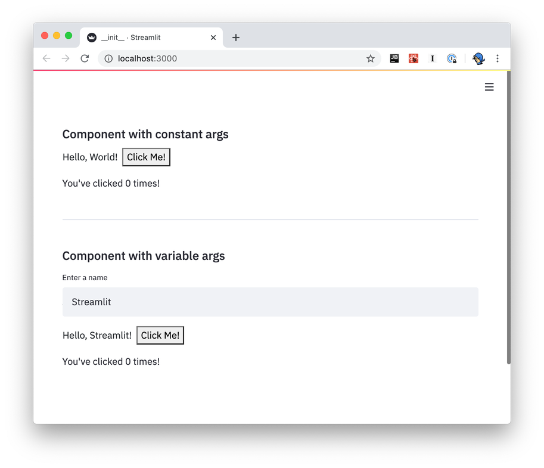

# Streamlit Component Svelte Template

This repo contains a template and example code for creating [Streamlit](https://streamlit.io) components using [Svelte](https://svelte.dev/) (+ Typescript) for the component's frontend.

It replicates the component from the [Streamlit official templates](https://github.com/streamlit/component-template). It relies on [Svelte Rollup template](https://github.com/sveltejs/template) and is inspired by the use of Svelte in Fanilo Andrianasolo's [Named Entity Selection Component](https://github.com/andfanilo/streamlit-named-entity-svelte).

For complete information, please see the [Streamlit Components documentation](https://docs.streamlit.io/en/latest/streamlit_components.html)!

## Overview

A Streamlit Component is made out of a Python API and a frontend (built using any web tech you prefer).

A Component can be used in any Streamlit app, can pass data between Python and frontend code, and can optionally be distributed on [PyPI](https://pypi.org/) for the rest of the world to use.

- Create a component's API in a single line of Python:

```python
import streamlit.components.v1 as components

# Declare the component:
my_component = components.declare_component("my_component", path="frontend/public")

# Use it:
my_component(greeting="Hello", name="World")
```

- Build the component's frontend out of HTML and JavaScript (or TypeScript, or ClojureScript, or whatever you fancy). In this case, with Svelte:

```html
<script lang="ts">
  import { setStreamlitLifecycle } from "./streamlit";
  setStreamlitLifecycle();

  // Access arguments from Python
  export let greeting: string;
  export let name: string;
</script>

<div>{greeting}, {name}!</div>
```

## Quickstart

- Ensure you have [Python 3.6+](https://www.python.org/downloads/), [Node.js](https://nodejs.org), and [npm](https://docs.npmjs.com/downloading-and-installing-node-js-and-npm) installed.
- Clone this repo.
- Create a new Python virtual environment for the template:

```
$ python3 -m venv venv  # create venv
$ . venv/bin/activate   # activate venv
$ pip install streamlit # install streamlit
```

- Initialize and run the component template frontend:

```
$ cd my_component/frontend
$ npm install    # Install npm dependencies
$ npm run dev    # Start the rollup dev server
```

- From a separate terminal, run the template's Streamlit app:

```
$ . venv/bin/activate  # activate the venv you created earlier
$ streamlit run my_component/__init__.py  # run the example
```

- If all goes well, you should see something like this:
  
- Modify the frontend code at `my_component/frontend/src/MyComponent.svelte`.
- Modify the Python code at `my_component/__init__.py`.

## Examples

- COMING SOON

## More Information

- [Streamlit Components documentation](https://docs.streamlit.io/en/stable/streamlit_components.html)
- [Streamlit Forums](https://discuss.streamlit.io/tag/custom-components)
- [Streamlit Components gallery](https://www.streamlit.io/components)
- [Svelte Tutorial](https://svelte.dev/tutorial)
- [Svelte <3 Typescript](https://svelte.dev/blog/svelte-and-typescript)
